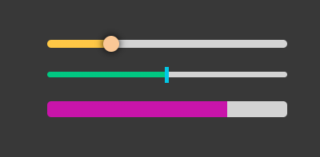

# v-slider-input

Vue slider components



```
npm install v-slider-input
```

## example

```vue
<template>
    <Slider v-model="x" :step="0.1" :min="-1" :max="1"></Slider>
    <VerticalSlider v-model="x" :step="0.1" :min="-1" :max="1"></VerticalSlider>
</template>

<script setup>
    import { Slider, VerticalSlider } from 'v-slider-input'
    const x = ref(0)
</script>
```

## props

prop | type | default | vertical default
-----|------|---------|-----------------
v-model | number | 0 | 0
min | number | 0 | 0
max | number | 100 | 100
step | number | 1 | 1
width | number | 300 | **10**
height | number | 10 | **300**
thumb-width | number | 20 | 20
thumb-height | number | 20 | 20
progress-color | string | red | red
track-style | object | {} | {}
thumb-style | object | {} | {}

## nuxt

```vue
<template>
    <ClientOnly>
        <Slider></Slider>        
    </ClientOnly>
</template>

<script setup>
    import { Slider, VerticalSlider } from 'v-slider-input'
</script>
```
